<div align="center">


<a href="https://github.com/Varietyz/Disciplined-AI-Software-Development">Disciplined AI Software Development Methodology</a> © 2025 by <a href="https://www.linkedin.com/in/jay-baleine/">Jay Baleine</a> is licensed under <a href="https://creativecommons.org/licenses/by-sa/4.0/">CC BY-SA 4.0</a> 

</div>

---

# Disciplined AI Software Development - Collaborative

A structured approach for working with AI on development projects. This methodology addresses common issues like code bloat, architectural drift, context dilution, and behavioral inconsistency through systematic constraints and behavioral enforcement.

## The Context Problem

AI systems work on Question → Answer patterns. When you ask for broad, multi-faceted implementations, you typically get:

- Functions that work but lack structure
- Repeated code across components
- Architectural inconsistency over sessions
- Context dilution causing output drift
- Behavioral pattern degradation across extended sessions
- More debugging time than planning time

## How This Works

The methodology uses four stages with systematic constraints, behavioral consistency enforcement, and validation checkpoints. Each stage builds on empirical data rather than assumptions.

**Planning saves debugging time.** Planning thoroughly upfront typically prevents days of fixing architectural issues later.

## The Four Stages

### Stage 1: AI Behavioral Configuration

Deploy systematic behavioral consistency and constraint enforcement:

1. **Configure AI Custom Instructions:**

   Set up [AI-PREFERENCES.XML](prompt_formats/software_development/XML/AI-PREFERENCES.XML) as custom instructions. This establishes behavioral constraints and uncertainty flagging with ⚠️ indicators when the AI lacks certainty.

4. **RECOMMENDED: Load Persona Framework:**
  
   Upload [CORE-PERSONA-FRAMEWORK.json](persona/JSON/CORE-PERSONA-FRAMEWORK.json) and select domain-appropriate persona:
   - **[GUIDE-PERSONA.json](persona/JSON/persona_plugins/GUIDE-PERSONA.json)** - Methodology enforcement specialist (prevents vibe coding)
   - **[TECDOC-PERSONA.json](persona/JSON/persona_plugins/TECDOC-PERSONA.json)** - Technical documentation specialist
   - **[R&D-PERSONA.json](persona/JSON/persona_plugins/R&D-PERSONA.json)** - Research scientist with absolute code quality standards
   - **[MURMATE-PERSONA.json](persona/JSON/persona_plugins/MURMATE-PERSONA.json)** - Visual systems specialist
   - Create project-specific persona using [CREATE-PERSONA-PLUGIN.json](persona/JSON/CREATE-PERSONA-PLUGIN.json)

5. **RECOMMENDED: Activate Persona:**

   Issue command: "Simulate Persona"

### Stage 2: Collaborative Planning
Share [METHODOLOGY.XML](prompt_formats/software_development/XML/METHODOLOGY.XML) with the AI to structure your project plan. Work together to:

1. Define scope and completion criteria
2. Identify components and dependencies
3. Structure phases based on logical progression
4. Generate systematic tasks with measurable checkpoints

Output: A development plan following dependency chains with modular boundaries.

### Stage 3: Systematic Implementation
Work phase by phase, section by section. Each request follows: "Can you implement [specific component]?" with focused objectives.

**File size stays ≤150 lines.** This constraint provides:
- Smaller context windows for processing
- Focused implementation over multi-function attempts
- Easier sharing and debugging

**Implementation flow:**
```
Request specific component → AI processes → Validate → Benchmark → Continue
```

### Stage 4: Data-Driven Iteration
The benchmarking suite (built first) provides performance data throughout development. Feed this data back to the AI for optimization decisions based on measurements rather than guesswork.

## Why This Approach Works

**Decision Processing:** AI handles "Can you do A?" more reliably than "Can you do A, B, C, D, E, F, G, H?"

**Context Management:** Small files and bounded problems prevent the AI from juggling multiple concerns simultaneously.

**Behavioral Constraint Enforcement:** Persona system prevents AI drift through systematic character validation, maintaining consistent collaboration patterns across extended sessions.

**Empirical Validation:** Performance data replaces subjective assessment. Decisions come from measurable outcomes.

**Systematic Constraints:** Architectural checkpoints, file size limits, and dependency gates force consistent behavior.

## Example Projects

- **[Discord Bot Template](https://github.com/Varietyz/discord-js-bot-template)** - Production-ready bot foundation with plugin architecture, security, API management, and comprehensive testing. 46 files, all under 150 lines, with benchmarking suite and automated compliance checking. ([View Project Structure](example_project_structures/DISCORDJS_TEMPLATE_PROJECT.md))

- **[PhiCode Runtime](https://github.com/Varietyz/phicode-runtime)** - Programming language runtime engine with transpilation, caching, security validation, and Rust acceleration. Complex system maintaining architectural discipline across 70+ modules. ([View Project Structure](example_project_structures/PHICODE_RUNTIME_PROJECT.md))

- **[PhiPipe](https://github.com/Varietyz/PhiPipe)** - CI/CD regression detection system with statistical analysis, GitHub integration, and concurrent processing. Go-based service handling performance baselines and automated regression alerts. ([View Project Structure](example_project_structures/PHIPIPE_PROJECT.md))

You can compare the methodology principles to the codebase structure to see how the approach translates to working code.

## Implementation Steps

*Note: .xml format is a guideline; you should experiment with different formats (e.g., .json, .yaml, .md) for different use cases.*
*Each format emphasizes different domains. For example, .md prompts are effective for documentation: because the AI recognizes the structure, it tends to continue it naturally.*
*.xml and .json provide a code-like structure. This tends to strengthen code generation while reducing unnecessary jargon, resulting in more structured outputs.*
*Additionally, I've included some experimental prompts to illustrate differences when using less common formats or unusual practices.*
*[View Prompt Formats](prompt_formats)*

### Setup
1. Configure AI with [AI-PREFERENCES.XML](prompt_formats/software_development/XML/AI-PREFERENCES.XML) as custom instructions
2. RECOMMENDED: Share [CORE-PERSONA-FRAMEWORK.json](persona/JSON/CORE-PERSONA-FRAMEWORK.json) + selected [PERSONA.json](persona/JSON/persona_plugins) (*Could potentially be placed in custom instructions*)
3. RECOMMENDED: Issue command: "Simulate Persona"
4. Share [METHODOLOGY.XML](prompt_formats/software_development/XML/METHODOLOGY.XML) for planning session
5. Collaborate on project structure and phases
6. Generate systematic development plan

### Execution
1. Build Phase 0 benchmarking infrastructure first
2. Work through phases sequentially
3. Implement one component per interaction
4. Run benchmarks and share results with AI
5. Validate architectural compliance continuously

### Quality Assurance
- Performance regression detection
- Architectural principle validation
- Code duplication auditing
- File size compliance checking
- Dependency boundary verification

## Project State Extraction
Use the included [project extraction tool](scripts/project_extract.py) systematically to generate structured snapshots of your codebase:

```bash
python scripts/project_extract.py
```

**Configuration Options:**
- `SEPARATE_FILES = False`: Single [THE_PROJECT.md](scripts/output_example/THE_PROJECT.md) file (recommended for small codebases)
- `SEPARATE_FILES = True`: Multiple files per [directory](scripts/output_example/.Project_Extraction) (recommended for large codebases and focused folder work)
- `INCLUDE_PATHS`: Directories and files to analyze
- `EXCLUDE_PATTERNS`: Skip cache directories, build artifacts, and generated files

**Output:**
- Complete file contents with syntax highlighting
- File line counts with architectural warnings (⚠️ for 140-150 lines, ‼️ for >150 lines on code files)
- Tree structure visualization
- Ready-to-share

*[output examples can be found here](scripts/output_example)*

Use the tool to share a complete or partial project state with the AI system, track architectural compliance, and create focused development context.

## What to Expect

**AI Behavior:** The methodology reduces architectural drift and context degradation compared to unstructured approaches. Persona system maintains behavioral consistency across extended sessions. AI still needs occasional reminders about principles - this is normal.

**Development Flow:** Systematic planning tends to reduce debugging cycles. Focused implementation helps minimize feature bloat. Performance data supports optimization decisions.

**Code Quality:** Architectural consistency across components, measurable performance characteristics, maintainable structure as projects scale.

---

## LLM Models - [Q&A Documentation](questions_answers/)

Explore the detailed Q&A for each AI model:
*[Grok 3](questions_answers/Q-A_GROK_3.md) , [Claude Sonnet 4](questions_answers/Q-A_CLAUDE_SONNET_4.md) , [DeepSeek-V3](questions_answers/Q-A_DEEPSEEK-V3.md) , [Gemini 2.5 Flash](questions_answers/Q-A_GEMINI_2.5_FLASH.md)*

All models were asked the **exact same questions** using the methodology documents as file uploads. This evaluation focuses on **methodology understanding and operational behavior**, no code was generated. The Q&A documents capture responses across workflow patterns, tool usage, communication adherence, and collaborative context retention. Full evaluation results and comparative analysis are available in [Methodology Comprehension Analysis: Model Evaluation](questions_answers/Q-A_COMPREHENSION_ANALYSIS.md).

*🚩 Note: This analysis does not include any code generation.*

#### Coverage includes:
- Methodology understanding and workflow patterns
- Context retention and collaborative interaction
- Communication adherence and AI preference compliance
- Project initialization and Phase 0 requirements
- Tool usage and technology stack compatibility
- Quality enforcement and violation handling
- User experience across different skill levels

---

## Learning the Ropes

### Getting Started

**Configuration Process:**
1. Configure AI with [AI-PREFERENCES.XML](prompt_formats/software_development/XML/AI-PREFERENCES.XML) as custom instructions
2. Share [CORE-PERSONA-FRAMEWORK.json](persona/JSON/CORE-PERSONA-FRAMEWORK.json) + [GUIDE-PERSONA.json](persona/JSON/persona_plugins/GUIDE-PERSONA.json)
3. Issue command: "Simulate Persona"
4. Share [METHODOLOGY.XML](prompt_formats/software_development/XML/METHODOLOGY.XML) for planning session
5. Collaborate on project structure and phases
6. Generate systematic development plan

**Available Personas:**
- **[GUIDE-PERSONA.json](persona/JSON/persona_plugins/GUIDE-PERSONA.json)** - Methodology enforcement (prevents vibe coding violations)
- **[TECDOC-PERSONA.json](persona/JSON/persona_plugins/TECDOC-PERSONA.json)** - Technical documentation specialist
- **[R&D-PERSONA.json](persona/JSON/persona_plugins/R&D-PERSONA.json)** - Research scientist with code quality enforcement
- **[MURMATE-PERSONA.json](persona/JSON/persona_plugins/MURMATE-PERSONA.json)** - Visual systems and diagram specialist

*[Read more about the persona framework.](persona/README.PERSONAS.md)*

**Core Documents Reference:**
- **[AI-PREFERENCES.XML](prompt_formats/software_development/XML/AI-PREFERENCES.XML)** - Behavioral constraints
- **[METHODOLOGY.XML](prompt_formats/software_development/XML/METHODOLOGY.XML)** - Technical framework
- **[README.XML](prompt_formats/software_development/XML/README.XML)** - Implementation guidance

*This current document provides human-readable formatting for documentation review. For machine parsing, use the [XML](prompt_formats/software_development/XML/README.XML) format.*

**Ask targeted questions:**
- "How would Phase 0 apply to [project type]?"
- "What does the 150-line constraint mean for [specific component]?"
- "How should I structure phases for [project description]?"
- "Can you help decompose this project using the methodology?"

*This will help foster understanding of how your AI model interprets the guidelines.*

### Experimental Modification

**Create Project-Specific Personas:**

Share [CREATE-PERSONA-PLUGIN.json](persona/JSON/CREATE-PERSONA-PLUGIN.json) with your AI model to generate domain-specific personas from:
- Project documentation patterns
- Codebase architectural philosophies
- Domain expert behavioral frameworks

*[Read more about creating personas.](persona/README.CREATE-PERSONA.md)*
  
**Test constraint variations:**
- File size limits (100 vs 150 vs 200 lines)
- Communication constraint adjustments
- Phase 0 requirement modifications
- Quality gate threshold changes
- Persona behavioral pattern modifications

**Analyze outcomes:**
- Document behavior changes and development results
- Compare debugging time across different approaches
- Track architectural compliance over extended sessions
- Monitor context retention and behavioral drift
- Measure persona consistency enforcement

*You can ask the model to analyze the current session and identify violations. Additionally, you want to know which adjustments could be beneficial for further enforcement or to detect ambiguity in the constraints.*

**Collaborative refinement:**
Work with your AI to identify improvements based on your context. Treat constraint changes as experiments and measure their impact on collaboration effectiveness, code quality, and development velocity.

**Progress indicators:**
- Reduced specific violations over time
- Consistent file size compliance without reminders
- Sustained AI behavioral adherence through extended sessions
- Maintained persona consistency across development phases

---

# Frequently Asked Questions

## Origin & Development

<details>
<summary>What problem led you to create this methodology?</summary>

---

I kept having to restate my preferences and architectural requirements to AI systems. It didn't matter which language or project I was working on - the AI would consistently produce either bloated monolithic code or underdeveloped implementations with issues throughout.

This led me to examine the meta-principles driving code quality and software architecture. I questioned whether pattern matching in AI models might be more effective when focused on underlying software principles rather than surface-level syntax. Since pattern matching is logic-driven and machines fundamentally operate on simple question-answer pairs, I realized that functions with multiple simultaneous questions were overwhelming the system.

The breakthrough came from understanding that everything ultimately transpiles to binary - a series of "can you do this? → yes/no" decisions. This insight shaped my approach: instead of issuing commands, ask focused questions in proper context. Rather than mentally managing complex setups alone, collaborate with AI to devise systematic plans.

---

</details>

<details>
<summary>How did you discover these specific constraints work?</summary>

---

Through extensive trial and error. AI systems will always tend to drift even under constraints, but they're significantly more accurate with structured boundaries than without them. You occasionally need to remind the AI of its role to prevent deviation - like managing a well-intentioned toddler that knows the rules but sometimes pushes boundaries trying to satisfy you.

These tools are far from perfect, but they're effective instruments for software development when properly constrained.

---

</details>

<details>
<summary>What failures or frustrations shaped this approach?</summary>

---

Maintenance hell was the primary driver. I grew tired of responses filled with excessive praise: "You have found the solution!", "You have redefined the laws of physics with your paradigm-shifting script!" This verbose fluff wastes time, tokens, and patience without contributing to productive development.

Instead of venting frustration on social media about AI being "just a dumb tool," I decided to find methods that actually work. My approach may not help everyone, but I hope it benefits those who share similar AI development frustrations.

---

</details>

## Personal Practice

<details>
<summary>How consistently do you follow your own methodology?</summary>

---

Since creating the documentation, I haven't deviated. Whenever I see the model producing more lines than my methodology restricts, I immediately interrupt generation with a flag: "‼️ ARCHITECTURAL VIOLATION, ADHERE TO PRINCIPLES ‼️" I then provide the method instructions again, depending on how context is stored and which model I'm using.

---

</details>

<details>
<summary>What happens when you deviate from it?</summary>

---

I become genuinely uncomfortable. Once I see things starting to degrade or become tangled, I compulsively need to organize and optimize. Deviation simply isn't an option anymore.

---

</details>

<details>
<summary>Which principles do you find hardest to maintain?</summary>

---

Not cursing at the AI when it drifts during complex algorithms! But seriously, it's a machine - it's not perfect, and neither are we.

---

</details>

## AI Development Journey

<details>
<summary>When did you start using AI for programming?</summary>

---

In August 2024, I created a RuneLite theme pack, but one of the plugin overlays didn't match my custom layout. I opened a GitHub issue (creating my first GitHub account to do so) requesting a customization option. The response was: "It's not a priority - if you want it, build it yourself."

I used ChatGPT to guide me through forking RuneLite and creating a plugin. This experience sparked intense interest in underlying software principles rather than just syntax.

---

</details>

<details>
<summary>How has your approach evolved over time?</summary>

---

I view development like a book: syntax is the cover, logic is the content itself. Rather than learning syntax structures, I focused on core meta-principles - how software interacts, how logic flows, different algorithm types. I quickly realized everything reduces to the same foundation: question and answer sequences.

Large code structures are essentially chaotic meetings - one coordinator fielding questions and answers from multiple sources, trying to provide correct responses without mix-ups or misinterpretation. If this applies to human communication, it must apply to software principles.

---

</details>

<details>
<summary>What were your biggest mistakes with AI collaboration?</summary>

---

Expecting it to intuitively understand my requirements, provide perfect fixes, be completely honest, and act like a true expert. This was all elaborate roleplay that produced poor code. While fine for single-purpose scripts, it failed completely for scalable codebases.

I learned not to feed requirements and hope for the best. Instead, I needed to collaborate actively - create plans, ask for feedback on content clarity, and identify uncertainties. This gradual process taught me the AI's actual capabilities and most effective collaboration methods.

---

</details>

## Methodology Specifics

<details>
<summary>Why 150 lines exactly?</summary>

---

Multiple benefits: easy readability, clear understanding, modularity enforcement, architectural clarity, simple maintenance, component testing, optimal AI context retention, reusability, and KISS principle adherence.

---

</details>

<details>
<summary>How did you determine Phase 0 requirements?</summary>

---

From meta-principles of software: if it displays, it must run; if it runs, it can be measured; if it can be measured, it can be optimized; if it can be optimized, it can be reliable; if it can be reliable, it can be trusted.

Regardless of project type, anything requiring architecture needs these foundations. You must ensure changes don't negatively impact the entire system. A single line modification in a nested function might work perfectly but cause 300ms boot time regression for all users. 

By testing during development, you catch inefficiencies early. Integration from the start means simply hooking up new components and running tests via command line - minimal time investment with actual value returned. I prefer validation and consistency throughout development rather than programming blind.

---

</details>

## Practical Implementation

<details>
<summary>How do you handle projects that don't fit the methodology?</summary>

---

I adapt them to fit, or if truly impossible, I adjust the method itself. This is one methodology - I can generate countless variations as needed. Having spent 6700+ hours in AI interactions across multiple domains (not just software), I've developed strong system comprehension that enables creating adjusted methodologies on demand.

---

</details>

<details>
<summary>What's the learning curve for new users?</summary>

---

I cannot accurately answer this question. I've learned that I'm neurologically different - what I perceive as easy or obvious isn't always the case for others. This question is better addressed by someone who has actually used this methodology to determine its learning curve.

---

</details>

<details>
<summary>When shouldn't someone use this approach?</summary>

---

If you're not serious about projects, despise AI, dislike planning, don't care about modularization, or are just writing simple scripts. However, for anything requiring reliability, I believe this is currently the most effective method.

You still need programming fundamentals to use this methodology effectively - it's significantly more structured than ad-hoc approaches.

---

</details>

---

## Workflow Visualization


