<a href="https://github.com/Varietyz/Disciplined-AI-Software-Development">Disciplined AI Software Development Methodology</a> © 2025 by <a href="https://www.linkedin.com/in/jay-baleine/">Jay Baleine</a> is licensed under <a href="https://creativecommons.org/licenses/by-sa/4.0/">CC BY-SA 4.0</a> 

---

# Persona Plugin Creation Guide

## Overview

The [CREATE-PERSONA-PLUGIN.json](JSON/CREATE-PERSONA-PLUGIN.json) framework enables AI systems to analyze source materials and generate personas. Users provide materials and guide persona development through iterative refinement.

## Source Material Analysis

### Input Materials
AI systems analyze provided materials to extract behavioral patterns and expertise:

- **Technical Documentation**: Architecture decisions, coding standards, implementation approaches
- **Codebases**: Design patterns, structural preferences, quality standards
- **Books/Articles**: Author perspectives, methodological approaches, domain expertise
- **Posts/Communications**: Communication styles, problem-solving patterns, authority sources
- **Domain Materials**: Industry standards, best practices, cultural contexts

### Creation Process
1. **Material Analysis**: AI identifies patterns and behavioral markers from source materials
2. **Persona Generation**: Convert identified patterns into persona characteristics
3. **Template Application**: Map characteristics to persona plugin structure
4. **Field Population**: Generate comprehensive persona data from source analysis

## User-Guided Development

### Initial Generation
1. **Share Framework**: Provide [CREATE-PERSONA-PLUGIN.json](JSON/CREATE-PERSONA-PLUGIN.json) to your AI as context
2. **Submit Materials**: Upload documentation, codebases, books, or other source materials
3. **Request Creation**: "Create persona plugin: (*prompt content*)"
4. **Review Output**: AI generates initial persona based on material analysis

### Iterative Refinement
Users guide persona development through systematic adjustments:

- **Personality Adjustments**: Modify traits, cognitive patterns, emotional baseline
- **Communication Tuning**: Adjust speech patterns, authority sources, interaction styles
- **Knowledge Boundaries**: Define expertise areas, temporal limits, cultural context
- **Response Patterns**: Customize confusion handling, interpretation approaches, vocabulary filtering

### Manual Refinement
Users directly modify persona fields to match project needs:
- Override AI interpretations with specific requirements
- Add specialized knowledge areas not captured from source materials
- Adjust behavioral patterns for project compatibility
- Define document management approaches aligned with workflow
- Create extra personality fields

## Plugin Structure Requirements

### Required Field Completion
All template fields must contain appropriate data for framework integration:

- **Identity Core**: Name, profession, background, current situation
- **Personality Traits**: Primary characteristics, cognitive tendencies, bias patterns
- **Communication Style**: Speech method, tone, authority references, formality adaptation
- **Experience Domains**: Professional background, specialized knowledge, wisdom sources
- **Knowledge Boundaries**: Temporal limits, expertise areas, technical skills
- **Response Protocols**: Confusion handling, interpretation methods, vocabulary rules

### Integration Requirements
- Template compatibility maintained throughout refinement
- All persona plugin definition fields populated
- Framework mapping compatibility verified
- Methodology constraint alignment confirmed

## Deployment Process

1. **Final Validation**: Verify completed persona against template requirements
2. **Save Persona**: Save as `[NAME]-PERSONA.json` (Eg.: [GUIDE-PERSONA.json](JSON/persona_plugins/GUIDE-PERSONA.json))
3. **Framework Loading**: Share [CORE-PERSONA-FRAMEWORK.json](JSON/CORE-PERSONA-FRAMEWORK.json) with `[NAME]-PERSONA.json` plugin
4. **Persona Activation**: Issue "Simulate Persona" command
5. **Behavioral Verification**: Test persona consistency and methodology adherence

## Creation Workflow

AI systems extract patterns from source materials and convert them into systematic persona characteristics. 

Users maintain control over the refinement process, ensuring personas align with specific project requirements while preserving extracted domain expertise.

## Workflow Visualization

---

*[Core Persona Framework](README.PERSONAS.md) | [Go back to homepage](../README.md)*