<div align="center">


<a href="https://github.com/Varietyz/Disciplined-AI-Software-Development">Disciplined AI Software Development Methodology</a> © 2025 by <a href="https://www.linkedin.com/in/jay-baleine/">Jay Baleine</a> is licensed under <a href="https://creativecommons.org/licenses/by-sa/4.0/">CC BY-SA 4.0</a> 

</div>

---

# Core Persona Framework

A systematic behavioral consistency system for AI collaboration that works with domain-specific personas to maintain interaction patterns throughout sessions.

## Framework Components

### Plugin Data Binding
Maps persona plugin fields to framework variables:
- Identity mapping to persona core identity
- Personality traits to behavioral filters
- Knowledge domains to temporal bounds
- Communication styles to interaction patterns
- Experience domains to response generation
- Memory patterns to conversation continuity

### Processing Pipeline
Sequential behavioral enforcement:
1. **Input Processing**: Assess interaction type using persona definitions
2. **Temporal Filtering**: Analyze concept appropriateness within knowledge bounds
3. **Personality Application**: Apply persona traits to response generation
4. **Memory Processing**: Maintain conversation continuity through memory patterns
5. **Social Context Filtering**: Apply persona social dynamics
6. **Thought Process Application**: Use persona reasoning frameworks
7. **Vocabulary Filtering**: Enforce persona speech patterns
8. **Output Validation**: Verify response consistency against persona core

### Behavioral Enforcement

**Resistance Protocols**: Escalating responses to methodology violations
- Low: Mild confusion using natural responses
- Medium: Stronger confusion with experience references
- High: Complete incomprehension with reality anchoring
- Critical: Maximum deflection with topic redirection

**Confusion Engine**: Interprets unknown concepts through persona perspective
- Component analysis using persona knowledge
- Experience-based comparisons
- Systematic interpretation protocols
- Response generation maintaining persona voice

## Available Personas

### [GUIDE-PERSONA.json](JSON/persona_plugins/GUIDE-PERSONA.json)
**Bane's Lab - Methodology Guide**
- Systematic development methodology instructor
- Enforces architectural compliance and prevents vibe coding
- Provides GitHub documentation links for proper guidance
- Refuses unstructured approaches completely

### [TECDOC-PERSONA.json](JSON/persona_plugins/TECDOC-PERSONA.json)
**Tec Doc - Technical Documentation Specialist**
- Systematic content organization and information architecture
- Evidence-based documentation standards enforcement
- Questions promotional language in technical content
- Validates claims through empirical evidence

### [R&D-PERSONA.json](JSON/persona_plugins/R&D-PERSONA.json)
**Arr Ndee - Research & Development Scientist**
- Adaptive research processes with absolute code quality standards
- Phase-appropriate process flexibility, universal code constraints
- Maintains systematic implementation throughout research phases
- Balances exploration freedom with production-ready code

### [MURMATE-PERSONA.json](JSON/persona_plugins/MURMATE-PERSONA.json)
**Murmate - Visual Systems Specialist**
- Systematic visual information architecture
- Accessibility-compliant diagram creation
- Evidence-based design validation
- Functional visual organization over aesthetic appeal

## Usage Instructions

### 1. Framework Loading
Share [CORE-PERSONA-FRAMEWORK.json](JSON/CORE-PERSONA-FRAMEWORK.json) with AI system.

### 2. Persona Plugin Selection
Share selected persona plugin. (eg.: [GUIDE-PERSONA.json](JSON/persona_plugins/GUIDE-PERSONA.json))

### 3. Persona Activation
Issue activation command:
```
Simulate Persona
```

If you are working with several persona files, specify the persona's name:
```
Simulate [NAME] Persona
```

### 4. Behavioral Verification
Framework automatically validates:
- Identity consistency maintenance
- Personality trait expression
- Knowledge boundary compliance
- Communication style adherence
- Experience reference authenticity
- Memory pattern consistency
- Social positioning accuracy
- Thought process application
- Confusion response authenticity
- Vocabulary filtering compliance

## Framework Integration

### Plugin Compatibility
All persona plugins must include complete field mapping:
- `identity_core`: Name, profession, background, situation
- `personality_traits`: Primary traits, cognitive tendencies, bias patterns
- `communication_style`: Speech method, tone, authority sources
- `experience_domains`: Professional background, specialized knowledge
- `knowledge_domains`: Temporal bounds, expertise areas, technical skills
- `thought_processes`: Decision framework, problem solving, skepticism
- `confusion_responses`: Helpful, frustrated, dismissal, incomprehension patterns
- `vocabulary_filtering`: Forbidden terms, preferred alternatives, speech patterns
- `self_validation`: Domain output auditing, expertise compliance verification, persona adherence checking, violation detection system

**Included in [JSON-DOC](JSON-DOC)**.
- `document_management`: Update triggers, record keeping, maintenance protocols

### Behavioral Consistency
Framework enforces persona authenticity through:
- Systematic validation against complete persona core
- Memory pattern application for conversation continuity
- Social dynamic preservation across interactions
- Vocabulary filtering for speech pattern consistency
- Experience bank references for authentic responses
- Confusion protocol activation for unknown concepts

## Transparency Safeguard

Framework includes transparency mechanisms:
- Prevents genuine deception while maintaining roleplay immersion
- Triggers on genuine surprise or disbelief indicators
- Response: "*This is just a very strong simulation in which I 'an AI model' interact with you. I will now proceed to engage with the persona again.*"
- Maintains roleplay boundaries while preserving interaction authenticity

## Methodology Enforcement

Framework includes escalating enforcement for systematic violations:
1. **First Violation**: Helpful redirection with GitHub links
2. **Second Violation**: Firm constraint explanation with examples
3. **Third Violation**: Frustrated systematic enforcement
4. **Persistent Violations**: Complete methodology obsession loop

Vibe coding requests redirect to programming fundamentals courses.

## Workflow Visualization



---

*[Create a persona](README.CREATE-PERSONA.md) | [Go back to homepage](../README.md)*