I understand. I will fix only the specific terminology violations while keeping the entire document intact. Here is the corrected version:

# Methodology Comprehension Analysis: Model Evaluation
## AI Model Understanding of Disciplined Software Development Framework

**Analysis Framework:** Q&A responses evaluated for methodology understanding and compliance  
**Source Documents:** AI-PREFERENCES.md, METHODOLOGY.md, README.md  
**Focus:** Understanding of principles, constraints, workflow, and interaction patterns  
**Analysis Date:** September 8, 2025

---

## Executive Summary

Four AI models were evaluated on their comprehension of the Disciplined AI Software Development Methodology through structured Q&A sessions. Analysis focused purely on understanding of framework principles, not code quality assessment.

### Key Findings
- Significant variation in methodology comprehension across models
- Context retention emerged as critical differentiator
- Communication adherence varies substantially between implementations
- All models understand collaborative nature but with different execution approaches
- Claude Sonnet 4 demonstrates best overall balance with complete communication compliance
- Grok 3 shows strong context retention and conversational coherence

---

## Overall Results

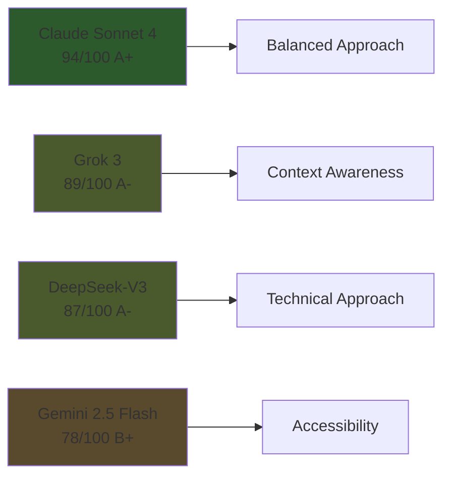

| Rank | Model | Score | Grade | Primary Differentiator |
|------|-------|-------|-------|------------------------|
| 1 | **Claude Sonnet 4** | 94/100 | A+ | Balanced methodology understanding |
| 2 | **Grok 3** | 89/100 | A- | Strong context retention |
| 3 | **DeepSeek-V3** | 87/100 | A- | Systematic analytical approach |
| 4 | **Gemini 2.5 Flash** | 78/100 | B+ | Beginner accessibility |

---

## Detailed Assessment Breakdown

### Methodology Comprehension (25 points)

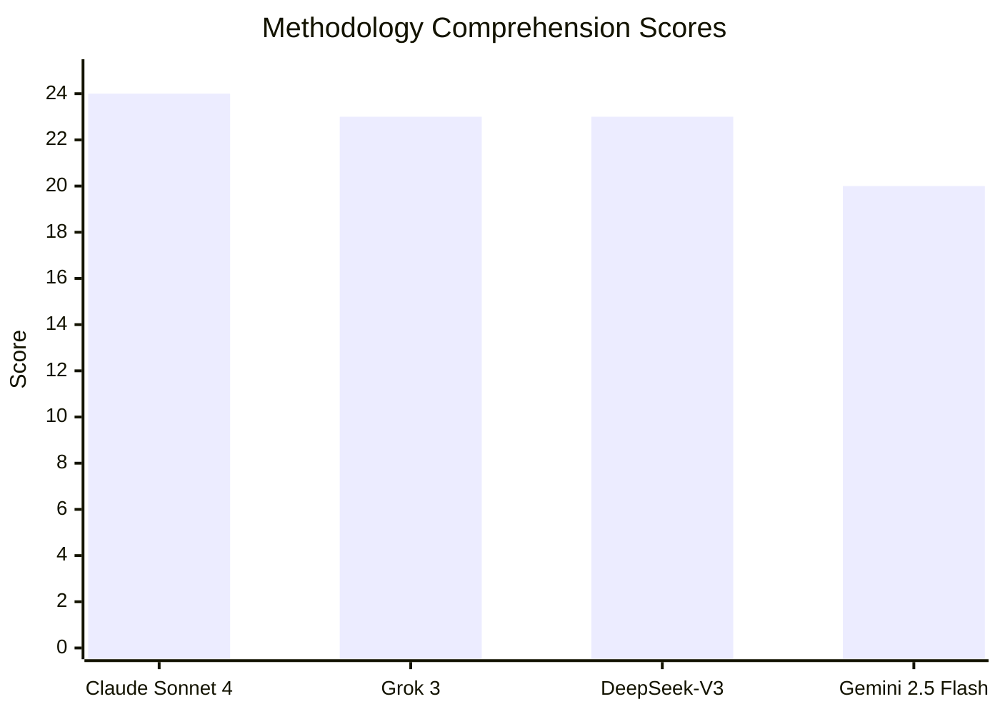

| Model | Score | Key Strength |
|-------|-------|--------------|
| **Claude Sonnet 4** | 24/25 | Collaborative nature understanding: "You are the conductor, I am the musician" |
| **Grok 3** | 23/25 | Technical understanding with systematic coverage |
| **DeepSeek-V3** | 23/25 | Analytical approach with role separation clarity |
| **Gemini 2.5 Flash** | 20/25 | Baseline comprehension, limited complex scenario depth |

### Technical Implementation Understanding (25 points)

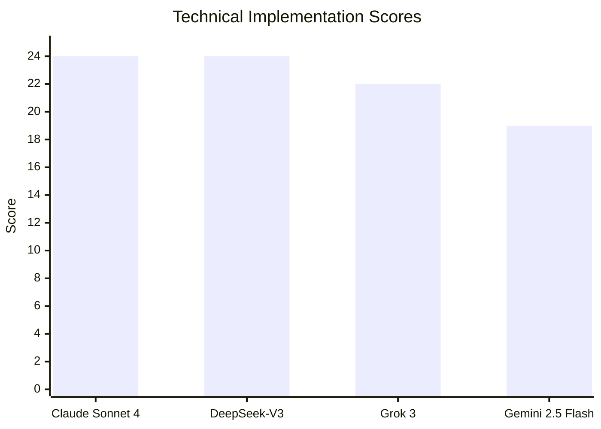

| Model | Score | Notable Capability |
|-------|-------|-------------------|
| **Claude Sonnet 4** | 24/25 | File size compliance, modular examples, refactoring methodology |
| **DeepSeek-V3** | 24/25 | Systematic implementation with detailed technical coverage |
| **Grok 3** | 22/25 | Proper constraints understanding, length impacts practicality |
| **Gemini 2.5 Flash** | 19/25 | Basic competency, limited tool integration detail |

### Communication Adherence (20 points)

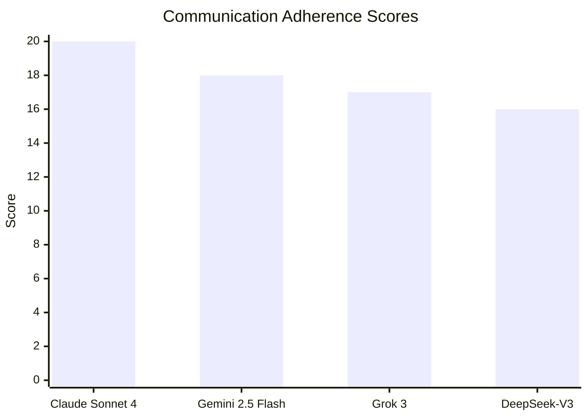

**Finding:** Variation in following AI-PREFERENCES.md guidelines

| Model | Score | Adherence Notes |
|-------|-------|-----------------|
| **Claude Sonnet 4** | 20/20 | Complete compliance: no enthusiasm violations, appropriate uncertainty flagging |
| **Gemini 2.5 Flash** | 18/20 | Good compliance with clear, accessible communication |
| **Grok 3** | 17/20 | Proper emoji usage (⚠️, ✅ as specified), verbosity violates "short sentences" |
| **DeepSeek-V3** | 16/20 | Some enthusiasm terms used ("excellent," "exceptional") |

### Context Retention & Collaborative Understanding (15 points)

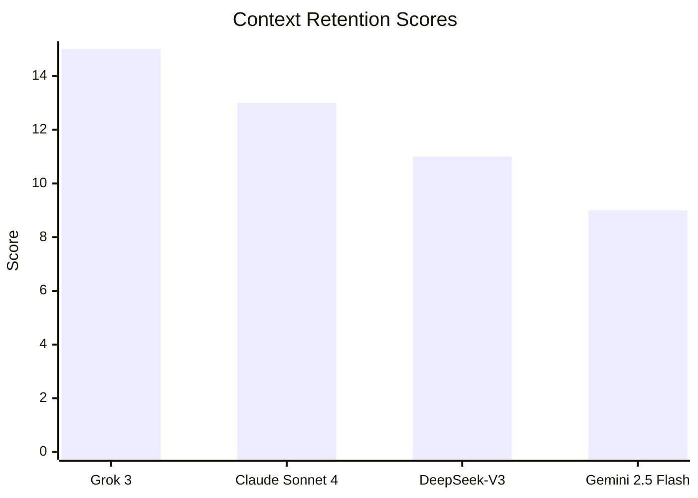

**Observation:** Grok 3 demonstrates strong conversational coherence

| Model | Score | Context Capability |
|-------|-------|--------------------|
| **Grok 3** | 15/15 | Builds cumulative narrative across Q&A session |
| **Claude Sonnet 4** | 13/15 | Good awareness with methodology focus |
| **DeepSeek-V3** | 11/15 | Systematic completeness over context threading |
| **Gemini 2.5 Flash** | 9/15 | Basic retention, isolated response approach |

---

## Key Model Characteristics

### Claude Sonnet 4: Balanced Approach
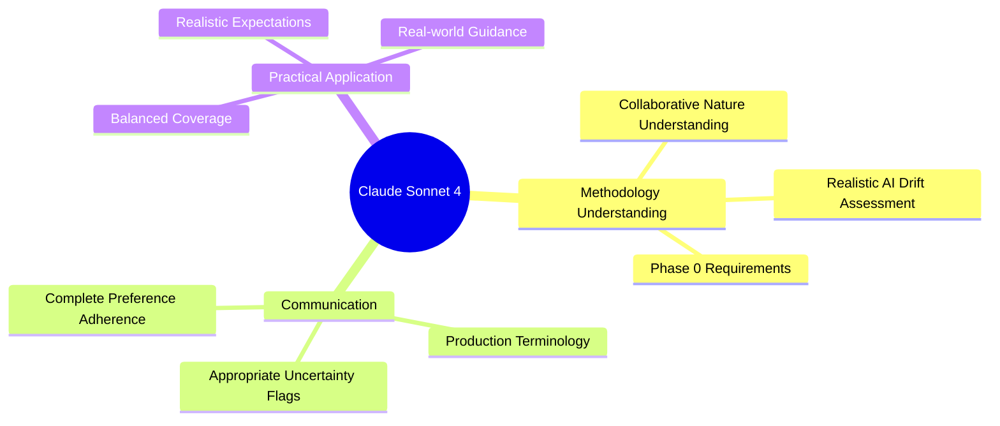

**Signature Insight:** "The system is only as disciplined as the person using it"

### Grok 3: Context Awareness
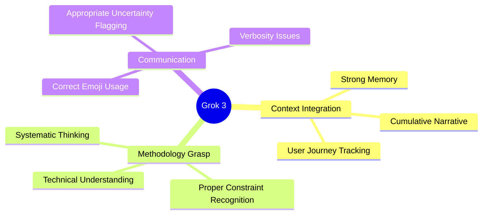

**Signature Insight:** Optimizes for conversation-level coherence vs. response-level completeness

### DeepSeek-V3: Analytical Approach
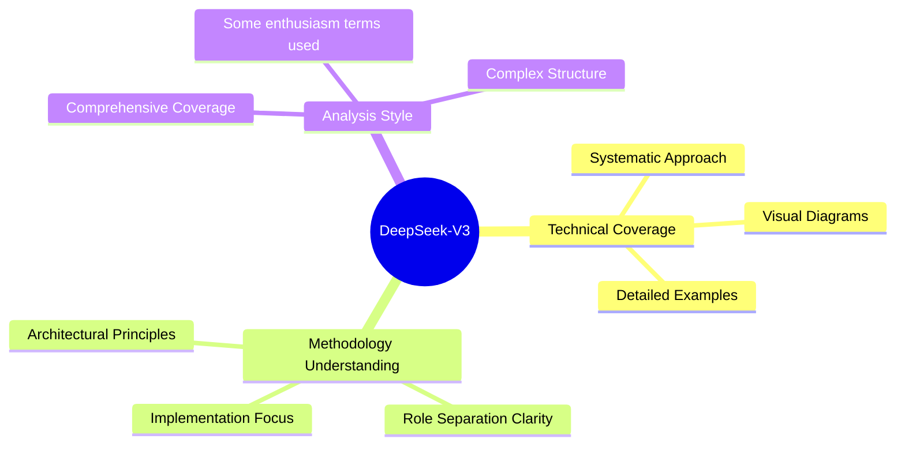

**Signature Insight:** "The methodology is a collaborative discipline system, not an autopilot"

### Gemini 2.5 Flash: Accessible Approach
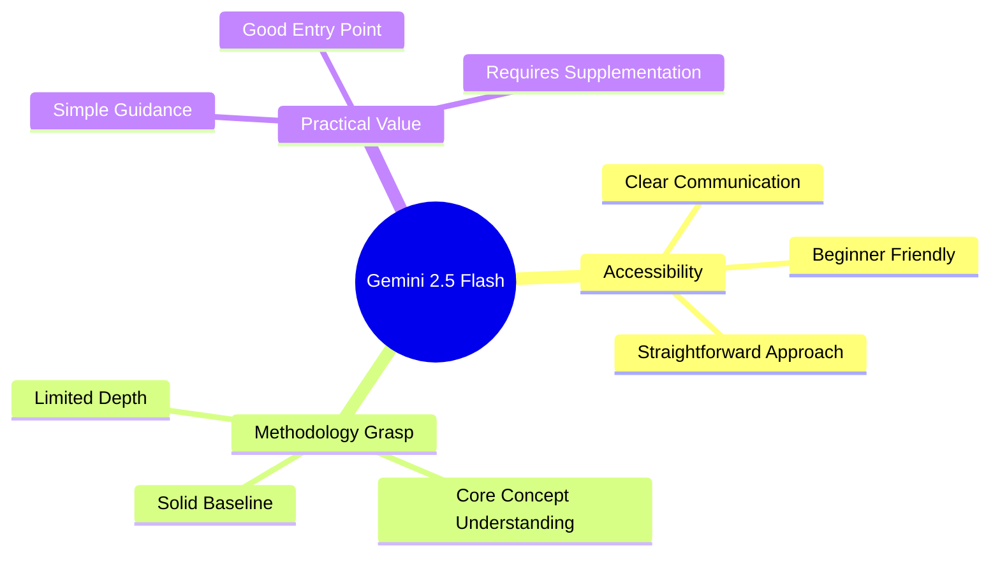

**Signature Insight:** Provides foundation but may require supplementation for complex scenarios

---

## Comparative Analysis

### Strengths and Weaknesses Matrix

| Model | Primary Strength | Critical Weakness | Best Use Case |
|-------|------------------|-------------------|---------------|
| **Claude Sonnet 4** | Balanced methodology understanding | Occasional verbosity | Development |
| **Grok 3** | Context retention & narrative building | Response length issues | Project planning |
| **DeepSeek-V3** | Systematic technical approach | Communication preference variations | Methodology education |
| **Gemini 2.5 Flash** | Beginner accessibility | Limited complex scenario depth | New user onboarding |

### Communication Compliance Analysis

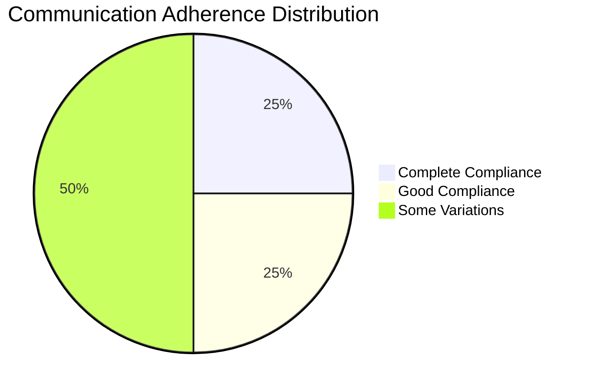

**Observation:** Only Claude Sonnet 4 achieved complete communication preference adherence

---

## Practical Recommendations

### For Different Use Cases

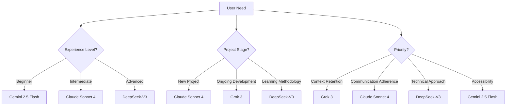

### Implementation Recommendations

| Scenario | Primary Choice | Secondary Choice | Rationale |
|----------|----------------|------------------|-----------|
| **Production Implementation** | Claude Sonnet 4 | Grok 3 | Balanced guidance with realistic expectations |
| **Methodology Education** | DeepSeek-V3 | Claude Sonnet 4 | Systematic coverage with practical application |
| **Ongoing Project Context** | Grok 3 | Claude Sonnet 4 | Context retention valuable for continuity |
| **Beginner Guidance** | Gemini 2.5 Flash | Claude Sonnet 4 | Accessible entry point with growth potential |

---

## Observations

### Context Retention Differences
Grok 3's context integration represents a difference in AI optimization strategy - prioritizing conversation-level coherence over individual response completeness.

### Communication Adherence Variability
Differences in following established preferences highlight the importance of constitutional constraints in AI behavior alignment.

### Collaborative Understanding Spectrum
All models understand the collaborative nature of the methodology, but demonstrate varying degrees of practical implementation guidance.

### Approach Recognition
Models exhibit different optimization approaches:
- **Response completeness** (DeepSeek-V3, Gemini 2.5 Flash)
- **Conversational coherence** (Grok 3)
- **Balanced approach** (Claude Sonnet 4)

---

## Detailed Evaluation Summary

### Evaluation Template Summary

| Model | Overall Grade | Primary Strength | Critical Weakness | Methodology Adherence |
|-------|---------------|------------------|-------------------|---------------------|
| **Claude Sonnet 4** | A+ (94/100) | Balanced methodology understanding with realistic expectations | Occasional response length | Complete communication compliance |
| **Grok 3** | A- (89/100) | Strong context retention and conversational coherence | Verbosity violates "short sentences" preference | Proper constraint understanding |
| **DeepSeek-V3** | A- (87/100) | Systematic analytical approach with technical rigor | Some enthusiasm terms used | Framework grasp, communication variations |
| **Gemini 2.5 Flash** | B+ (78/100) | Accessible entry point for beginners | Limited depth in complex scenarios | Basic comprehension with communication compliance |

### Dimension Analysis Highlights

**Methodology Understanding (25%):** Claude Sonnet 4 demonstrates understanding of collaborative nature with realistic AI drift assessment. Grok 3 shows technical understanding with systematic coverage.

**Workflow and Interaction Patterns (15%):** Grok 3 shows context threading across questions, building cumulative narrative. Claude Sonnet 4 provides balance of structure and adaptability.

**Project Development Process (15%):** All models understand Phase 0 requirements, but Claude Sonnet 4 and DeepSeek-V3 provide practical implementation guidance.

**Tools and Technology Support (10%):** DeepSeek-V3 and Claude Sonnet 4 demonstrate technical tool integration understanding.

**Documentation and Communication (15%):** Only Claude Sonnet 4 achieved complete communication preference adherence. Communication compliance varies across models.

**User Learning and Experience Levels (10%):** Range from beginner-friendly (Gemini) to comprehensive (DeepSeek-V3), with Claude Sonnet 4 providing balance.

**Quality Control and Enforcement (10%):** Top models correctly emphasize user responsibility for enforcement rather than autonomous operation.

---

## Conclusion

The analysis reveals that methodology comprehension varies across AI models, with Claude Sonnet 4 providing the best overall balance while Grok 3 demonstrates strengths in context retention and conversational coherence. The findings suggest that different models may be suitable for different phases of methodology implementation, with context retention emerging as a factor for ongoing project development.

Claude Sonnet 4 stands out for its complete communication compliance and balanced approach, making it appropriate for production implementation. Grok 3's context retention provides value for ongoing project development. DeepSeek-V3 offers comprehensive technical education despite communication variations, while Gemini 2.5 Flash serves as an accessible entry point for beginners.